# CG-Lab 计算机图形学课程作业

## 学生信息

- **姓名**：付雅婷
- **班级**：24级计算机科学与技术（公费师范）
- **课程**：计算机图形学
- **教师**：张鸿文
- **助教**：张怡冉

---

## 项目结构

```
CG-Lab/
├── src/
│   ├── Work0/                          # 实验一：粒子系统
│   │   ├── config.py
│   │   ├── physics.py
│   │   └── main.py
│   ├── Work1/                          # 实验二：三角形旋转
│   │   ├── main.py
│   │   └── transform.py
│   ├── Work2/                          # 实验二选做：3D立方体旋转
│   │   ├── main.py
│   │   └── transform.py
│   ├── Work3/                          # 实验三：贝塞尔曲线
│   │   └── main.py
│   ├── Work4/                          # 实验三选做：反走样+B样条
│   │   └── main.py
│   ├── Work5/                          # 实验四：Phong光照模型
│   │   └── main.py
│   ├── Work6/                          # 实验四选做：Blinn-Phong+阴影
│   │   └── main.py
│   ├── Work7/                          # 实验五：光线追踪
│   │   └── main.py
│   ├── Work8/                          # 实验五选做：玻璃材质+MSAA
│   │   └── main.py
│   ├── Work9/                          # 实验六：可微渲染
│   │   └── main.py
│   ├── Work10/                         # 实验六选做：联合纹理优化
│   │   └── main.py
│   ├── Work11/                         # 实验七：质点弹簧模型
│   │   └── main.py
│   ├── Work12/                         # 实验七选做：弹簧模型+碰撞
│   │   └── main.py
│   ├── Work13/                         # 实验八：LBS蒙皮
│   │   └── main.py
│   └── Work14/                         # 实验八选做：姿态动画
│       └── animation.py
├── outputs/                            # LBS蒙皮输出图片
├── outputs_animation/                  # 姿态动画输出
├── models/smpl/                        # SMPL模型文件
├── work0.gif                           # 实验一演示动图
├── work1.gif                           # 实验二演示动图
├── work2.gif                           # 实验二选做演示动图
├── work3.gif                           # 实验三演示动图
├── work4.gif                           # 实验三选做演示动图
├── work5.gif                           # 实验四演示动图
├── work6.gif                           # 实验四选做演示动图
├── work7.gif                           # 实验五演示动图
├── work8.gif                           # 实验五选做演示动图
├── work9.gif                           # 实验六演示动图
├── work10_progress.gif                 # 实验六选做优化过程
├── loss_curve.png                      # 实验六选做损失曲线
├── work11.gif                          # 实验七演示动图
├── work12.gif                          # 实验七选做演示动图
├── work13.gif                          # 实验八演示动图
├── work14.gif                          # 实验八选做演示动图
└── README.md
```

---

## 实验一：万有引力粒子群仿真 (Work0)

### 实验目标

- 掌握 uv 包管理器与项目级环境隔离
- 理解 src 布局与代码分层解耦
- 实现 GPU 加速的粒子系统

### 技术要点

- **GPU 并行计算**：Taichi 自动部署到 CUDA 后端
- **实时交互**：鼠标移动产生力场影响粒子
- **平滑渲染**：60fps 实时可视化

### 运行方法

```bash
uv run -m src.Work0.main
```

### 交互操作

| 操作 | 功能 |
|------|------|
| 鼠标移动 | 产生力场影响粒子 |
| ESC | 退出程序 |

### GPU 加速情况

```
[Taichi] version 1.7.4, llvm 15.0.1, commit b4b956fd, win, python 3.12.13
[Taichi] Starting on arch=cuda
```

### 运行效果演示

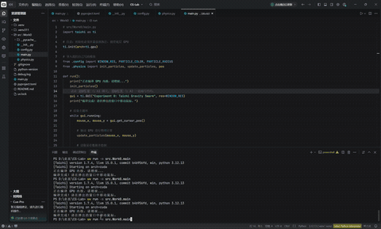

### 代码分层设计

| 文件 | 功能 |
|------|------|
| config.py | 配置参数（粒子数量、引力常数、窗口大小） |
| physics.py | 万有引力计算和粒子位置更新（GPU 并行） |
| main.py | GUI 初始化、渲染循环、鼠标交互 |

### 实验完成情况

- [x] 基础图形学开发环境搭建（uv + Taichi）
- [x] src 布局重构和代码分层
- [x] GPU 粒子系统实现
- [x] 演示动图上传

---

## 实验二：旋转与变换 - 三角形 (Work1)

### 实验目标

- 理解 MVP（模型-视图-投影）变换流程
- 独立推导并实现三种变换矩阵
- 掌握齐次坐标与透视除法

### 三角形顶点坐标

| 顶点 | X | Y | Z |
|------|---|---|---|
| v0 | 2.0 | 0.0 | -2.0 |
| v1 | 0.0 | 2.0 | -2.0 |
| v2 | -2.0 | 0.0 | -2.0 |

### 核心功能

| 变换 | 功能描述 |
|------|----------|
| 模型变换 | 绕 Z 轴旋转的变换矩阵 |
| 视图变换 | 将相机平移到世界坐标系原点 |
| 投影变换 | 透视投影，将平截头体压缩到 [-1,1]³ |

### 运行方法

```bash
uv run -m src.Work1.main
```

### 交互操作

| 按键 | 功能 |
|------|------|
| A | 三角形顺时针旋转 |
| D | 三角形逆时针旋转 |
| ESC | 退出程序 |

### 运行效果演示

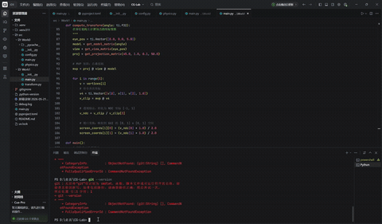

### 实验完成情况

- [x] 模型变换矩阵（绕 Z 轴旋转）
- [x] 视图变换矩阵（相机平移）
- [x] 透视投影矩阵
- [x] 三角形线框渲染
- [x] 演示动图上传

---

## 实验二选做：3D 立方体透视旋转 (Work2)

### 实验目标

- 将三角形升级为三维立方体
- 实现多轴旋转控制
- 体验透视投影的立体感

### 立方体信息

| 属性 | 值 |
|------|-----|
| 顶点数量 | 8 个 |
| 边的数量 | 12 条 |
| 边长 | 2 |
| 中心位置 | 原点 (0,0,0) |

### 运行方法

```bash
python src/Work2/main.py
```

### 交互操作

| 按键 | 功能 |
|------|------|
| A/D | 绕 Y 轴旋转 |
| W/S | 绕 X 轴旋转 |
| Q/E | 绕 Z 轴旋转 |
| Space | 暂停/继续自动旋转 |
| R | 重置所有角度 |
| ESC | 退出程序 |

### 运行效果演示

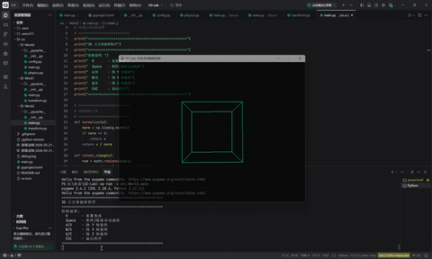

### 选做完成情况

- [x] 3D 立方体构建（8顶点+12边）
- [x] 绕 X/Y/Z 轴多角度旋转矩阵
- [x] 透视投影和视图变换
- [x] 自动旋转模式
- [x] 演示动图上传

---

## 实验三：贝塞尔曲线 (Work3)

### 实验目标

- 理解贝塞尔曲线的几何意义
- 实现 De Casteljau 算法
- 掌握鼠标交互事件处理

### 算法原理

**De Casteljau 算法**是一种利用"递归线性插值"来求取贝塞尔曲线坐标的算法。

对于给定的参数 t ∈ [0,1]：

1. 在相邻控制点连线上找到比例为 t 的点
2. 对新产生的点重复此操作
3. 当只剩一个点时，该点即为曲线上对应 t 的位置

### 曲线特性

| 控制点数量 | 曲线类型 |
|------------|----------|
| 2 个点 | 直线（一阶贝塞尔曲线） |
| 3 个点 | 抛物线（二阶贝塞尔曲线） |
| 4 个点 | 三次贝塞尔曲线 |
| n 个点 | n-1 阶贝塞尔曲线 |

### 运行方法

```bash
uv run -m src.Work3.main
```

### 交互操作

| 操作 | 功能 |
|------|------|
| 鼠标左键 | 添加控制点（红色圆点） |
| C 键 | 清空所有控制点 |
| ESC | 退出程序 |

### 视觉元素

| 元素 | 颜色 | 含义 |
|------|------|------|
| 圆点 | 红色 | 控制点 |
| 连线 | 灰色 | 控制多边形 |
| 曲线 | 绿色 | 贝塞尔曲线 |

### 运行效果演示

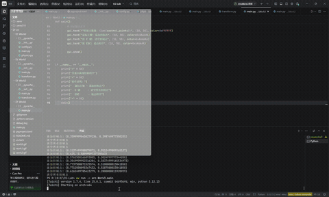

### 实验完成情况

- [x] De Casteljau 算法实现
- [x] 鼠标左键添加控制点
- [x] 控制多边形绘制
- [x] 贝塞尔曲线绘制
- [x] 演示动图上传

---

## 实验三选做：反走样与 B 样条曲线 (Work4)

### 实验目标

- 实现反走样效果
- 实现均匀三次 B 样条曲线
- 对比贝塞尔与 B 样条的差异

### 功能特性

- **反走样**：按 A 键开启/关闭，曲线边缘更平滑
- **B样条曲线**：按 B 键切换，支持局部控制
- **贝塞尔曲线**：绿色
- **B样条曲线**：黄色

### 运行方法

```bash
uv run -m src.Work4.main
```

### 交互操作

| 按键 | 功能 |
|------|------|
| 鼠标左键 | 添加控制点 |
| B 键 | 切换曲线模式（贝塞尔/B样条） |
| A 键 | 切换反走样 |
| C 键 | 清空控制点 |
| ESC | 退出程序 |

### 运行效果演示

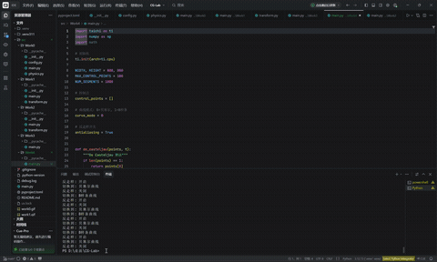

### 选做完成情况

- [x] 反走样效果实现
- [x] 均匀三次 B 样条曲线实现
- [x] 模式切换功能
- [x] 演示动图上传

---

## 实验四：Phong 光照模型 (Work5)

### 实验目标

- 理解环境光、漫反射、镜面高光
- 实现光线与球体、圆锥的求交
- 实现深度测试（Z-buffer）

### 场景内容

| 物体 | 位置 | 颜色 |
|------|------|------|
| 球体 | 左侧 | 红色 |
| 圆锥 | 右侧 | 紫色 |
| 光源 | 可移动 | 白色 |

### 运行方法

```bash
uv run -m src.Work5.main
```

### 交互操作

| 按键 | 功能 |
|------|------|
| Q | 增加环境光 (Ka) |
| A | 减少环境光 (Ka) |
| W | 增加漫反射 (Kd) |
| S | 减少漫反射 (Kd) |
| E | 增加高光 (Ks) |
| D | 减少高光 (Ks) |
| R | 增加高光指数 (Shininess) |
| F | 减少高光指数 (Shininess) |
| ESC | 退出程序 |

### 运行效果演示

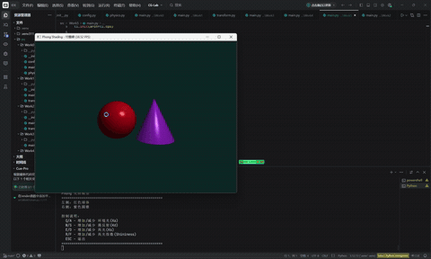

### 实验完成情况

- [x] 光线与球体、圆锥求交
- [x] 深度测试与遮挡关系
- [x] Phong 光照模型实现
- [x] 键盘交互控制
- [x] 演示动图上传

---

## 实验四选做：Blinn-Phong 光照模型 + 硬阴影 (Work6)

### 实验目标

- 实现 Blinn-Phong 光照模型
- 实现硬阴影效果
- 对比两种光照模型差异

### 功能特性

- **Blinn-Phong 模型**：使用半程向量 H，高光更平滑
- **硬阴影**：向光源发射 Shadow Ray 检测遮挡
- **模式切换**：P 键切换 Phong/Blinn-Phong
- **阴影开关**：H 键开启/关闭阴影

### 运行方法

```bash
uv run -m src.Work6.main
```

### 交互操作

| 按键 | 功能 |
|------|------|
| Q/A | 增加/减少 环境光 (Ka) |
| W/S | 增加/减少 漫反射 (Kd) |
| E/D | 增加/减少 高光 (Ks) |
| R/F | 增加/减少 高光指数 |
| P | 切换 Phong / Blinn-Phong |
| H | 切换阴影 开/关 |
| ESC | 退出程序 |

### 运行效果演示

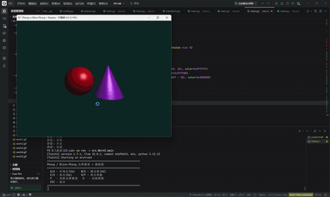

### 选做完成情况

- [x] Blinn-Phong 光照模型实现
- [x] 硬阴影实现（Shadow Ray）
- [x] 模式切换功能
- [x] 演示动图上传

---

## 实验五：光线追踪 (Work7)

### 实验目标

- 理解光线投射与光线追踪的区别
- 实现硬阴影和镜面反射
- 实现迭代式光线追踪

### 场景内容

| 物体 | 位置 | 材质 | 颜色 |
|------|------|------|------|
| 球体（左） | (-1.2, 0, 0) | 镜面反射 | 银色 |
| 球体（右） | (1.2, 0, 0) | 镜面反射 | 银色 |
| 地面 | y = -1.0 | 漫反射 | 黑白棋盘格 |

### 运行方法

```bash
uv run -m src.Work7.main
```

### 交互操作

| 按键 | 功能 |
|------|------|
| Q/A | 光源 X 轴移动 |
| W/S | 光源 Y 轴移动 |
| E/D | 光源 Z 轴移动 |
| R/F | 增加/减少 最大弹射次数 |
| ESC | 退出程序 |

### 运行效果演示

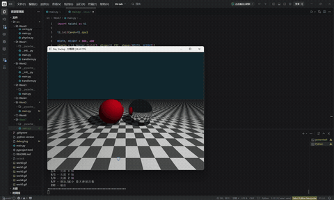

### 实验完成情况

- [x] 光线与球体、平面求交
- [x] 硬阴影实现
- [x] 镜面反射材质
- [x] 棋盘格纹理地面
- [x] 光源位置交互控制
- [x] 演示动图上传

---

## 实验五选做：玻璃材质 + 抗锯齿 (Work8)

### 实验目标

- 实现玻璃材质（折射+反射）
- 实现 MSAA 抗锯齿
- 优化边缘平滑度

### 功能特性

- **玻璃材质**：左侧球体改为玻璃材质
- **MSAA 抗锯齿**：按 Z/X 键调整采样次数
- **镜面反射**：右侧球体保持镜面材质

### 运行方法

```bash
uv run -m src.Work8.main
```

### 交互操作

| 按键 | 功能 |
|------|------|
| Q/A | 光源 X 轴移动 |
| W/S | 光源 Y 轴移动 |
| E/D | 光源 Z 轴移动 |
| R/F | 增加/减少 最大弹射次数 |
| Z/X | 增加/减少 MSAA 采样次数 |
| ESC | 退出程序 |

### 运行效果演示

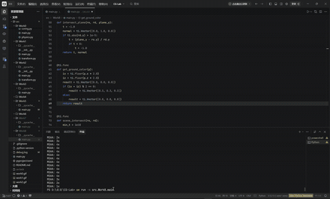

### 选做完成情况

- [x] 玻璃材质实现
- [x] MSAA 抗锯齿实现
- [x] 光源位置交互控制
- [x] 演示动图上传

---

## 实验六：可微渲染 (Work9)

### 实验目标

- 理解可微光栅化原理
- 通过多视角剪影反推三维网格
- 掌握网格正则化方法

### 运行环境

- ModelScope 云平台（免费 GPU）
- PyTorch3D

### 场景内容

| 初始形状 | 目标形状 | 优化方式 |
|----------|----------|----------|
| 球体 | 奶牛 | 顶点偏移 |

### 优化过程

- 从球体开始，通过梯度下降逐渐变形
- 多视角剪影损失（20 个视角）
- 正则化：拉普拉斯平滑 + 边长惩罚 + 法线一致性

### 运行方法

```bash
# 在 ModelScope 云平台运行
python src/Work9/main.py
```

### 运行效果演示

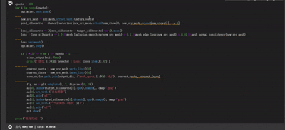

### 实验完成情况

- [x] 软光栅化实现
- [x] 多视角剪影优化
- [x] 拉普拉斯正则化
- [x] 边长一致性正则化
- [x] 法线一致性正则化
- [x] 演示动图上传

---

## 实验六选做：联合纹理优化 (Work10)

### 实验目标

- 同时优化网格顶点和纹理
- 拟合 RGB 图像和剪影
- 理解可微渲染在纹理优化中的应用

### 损失函数设置

| 损失项 | 权重 | 作用 |
|--------|------|------|
| RGB 损失 | 1.0 | 拟合目标颜色图像 |
| 剪影损失 | 1.0 | 拟合目标轮廓 |
| 拉普拉斯平滑 | 1.0 | 保持表面光滑 |
| 边长惩罚 | 1.0 | 防止三角形过度拉伸 |
| 法线一致性 | 0.01 | 保持相邻面法线方向一致 |

### 优化过程

- 迭代次数：1000 次
- 优化器：SGD（lr=1.0, momentum=0.9）
- 每 50 次迭代记录一帧

### 运行效果演示

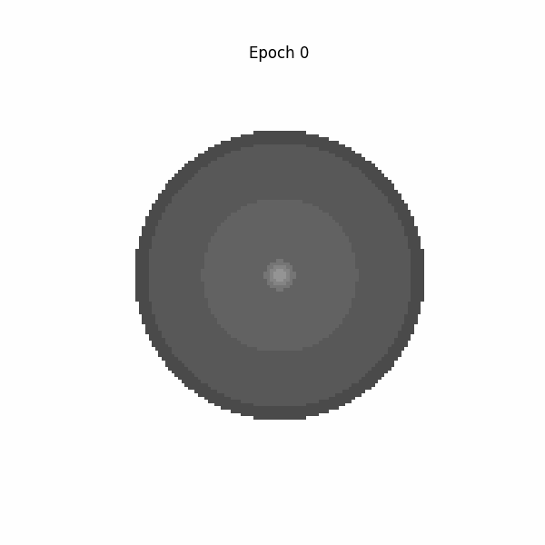

*球体逐渐变形为带纹理的奶牛过程*


*各类损失函数随迭代次数的变化曲线*

### 选做完成情况

- [x] 联合纹理优化实现
- [x] RGB 图像拟合
- [x] 网格顶点优化
- [x] 纹理贴图优化
- [x] 正则化损失实现
- [x] 演示动图上传

---

## 实验七：质点弹簧模型 (Work11)

### 实验目标

- 掌握基于物理的弹力与阻尼力计算
- 对比三种数值积分方法
- 理解 GPU 编程中的并行计算

### 积分方法对比

| 方法 | 稳定性 | 计算量 | 适用场景 |
|------|--------|--------|----------|
| 显式欧拉 | 差，易发散 | 低 | 教学演示 |
| 半隐式欧拉 | 中等 | 中 | 实时模拟 |
| 隐式欧拉 | 好，稳定 | 高 | 高精度模拟 |

### 运行方法

```bash
uv run -m src.Work11.main
```

### 交互操作

| 按键 | 功能 |
|------|------|
| E | 切换到显式欧拉 |
| S | 切换到半隐式欧拉 |
| I | 切换到隐式欧拉 |
| P | 暂停/恢复 |
| R | 重置布料 |
| ESC | 退出程序 |

### 运行效果演示

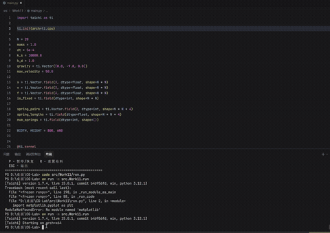

### 实验完成情况

- [x] 结构弹簧系统实现
- [x] 三种数值积分方法
- [x] 速度钳制防数值爆炸
- [x] GGUI 交互面板
- [x] 演示动图上传

---

## 实验七选做：完善弹簧模型 + 空间碰撞 (Work12)

### 新增功能

- **剪切弹簧**：对角线方向连接，增强抗剪切能力
- **弯曲弹簧**：间隔一个点的连接，增加弯曲刚度
- **球体碰撞**：布料与球体的碰撞检测与响应

### 弹簧类型对比

| 弹簧类型 | 连接方式 | 作用 |
|----------|----------|------|
| 结构弹簧 | 相邻网格点 | 保持布料基本形状 |
| 剪切弹簧 | 对角线方向 | 防止剪切变形 |
| 弯曲弹簧 | 间隔一个点 | 增加弯曲刚度 |

### 运行方法

```bash
uv run -m src.Work12.main
```

### 交互操作

| 按键 | 功能 |
|------|------|
| C | 开启/关闭球体碰撞 |
| S | 开启/关闭弹簧显示 |
| P | 暂停/恢复 |
| R | 重置布料 |
| ESC | 退出程序 |

### 运行效果演示

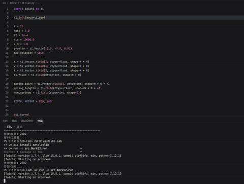

### 选做完成情况

- [x] 剪切弹簧实现
- [x] 弯曲弹簧实现
- [x] 球体碰撞实现
- [x] 交互控制
- [x] 演示动图上传

---

## 实验八：LBS 蒙皮 (Work13)

### 实验目标

- 理解参数化人体模型 SMPL
- 掌握 LBS 四个阶段
- 学会调用 SMPL 模型并可视化关键中间量

### LBS 四个阶段

| 阶段 | 名称 | 说明 |
|------|------|------|
| (a) | 模板网格 + 蒙皮权重 | 初始状态，每个顶点带有对各关节的权重 |
| (b) | 形状校正 + 关节回归 | 形状参数 β 控制体型，回归关节位置 |
| (c) | 姿态校正 | 姿态相关校正 B_P(θ)，避免膝盖等部位的穿透 |
| (d) | 线性混合蒙皮 | 最终顶点 = 各关节变换的加权平均 |

### 运行方法

```bash
uv run -m src.Work13.main --model-dir ./models --out-dir ./outputs --joint-id 18
```

### 输出文件

| 文件 | 说明 |
|------|------|
| stage_a_template_weights.png | 模板网格 + 指定关节权重热力图 |
| stage_b_shaped_joints.png | 形状变化后的网格 + 回归出的关节点 |
| stage_c_pose_offsets.png | 姿态校正偏移量可视化 |
| stage_d_lbs_result.png | 最终 LBS 蒙皮结果 |
| comparison_grid.png | 四个阶段对比图 |
| all_joint_weights.png | 全关节主导权重分布图 |
| summary.txt | 模型信息 + 手写 LBS 与官方结果误差 |

### 运行效果演示


### 实验完成情况

- [x] SMPL 模型加载与信息输出
- [x] 模板网格与蒙皮权重可视化
- [x] 形状校正与关节回归
- [x] 姿态校正可视化
- [x] 完整 LBS 结果可视化
- [x] 四阶段对比图
- [x] 手写 LBS 与官方结果一致性验证（误差为 0）
- [x] 演示动图上传

---

## 实验八选做：姿态动画 (Work14)

### 实验目标

- 固定 shape 参数
- 让关节从 0° 逐渐旋转到某角度
- 观察权重区域随骨骼运动的平滑带动

### 动画设置

| 参数 | 值 |
|------|-----|
| 旋转关节 | left_shoulder（左肩，索引 16） |
| 角度范围 | 0° → 90° |
| 帧数 | 30 帧 |
| 固定 shape | β₁ = 1.5（胖），β₂ = -0.8（矮） |

### 运行方法

```bash
uv run -m src.Work14.animation
```

### 输出文件

| 文件 | 说明 |
|------|------|
| lbs_animation.gif | 完整姿态动画 |
| keyframe_0deg.png | 起始帧（0°） |
| keyframe_22deg.png | 22° 关键帧 |
| keyframe_45deg.png | 45° 关键帧 |
| keyframe_67deg.png | 67° 关键帧 |
| keyframe_90deg.png | 结束帧（90°） |

### 运行效果演示

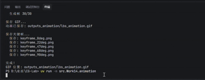

### 选做完成情况

- [x] 固定 shape 参数
- [x] 关节角度逐渐变化
- [x] 生成动画 GIF
- [x] 保存关键帧图片
- [x] 演示动图上传

---

## 实验完成总览

| 实验 | 目录 | 类型 | 状态 |
|------|------|------|------|
| 实验一 | Work0 | 粒子系统 | ✅ |
| 实验二 | Work1 | 三角形旋转 | ✅ |
| 实验二选做 | Work2 | 3D立方体 | ✅ |
| 实验三 | Work3 | 贝塞尔曲线 | ✅ |
| 实验三选做 | Work4 | 反走样+B样条 | ✅ |
| 实验四 | Work5 | Phong光照 | ✅ |
| 实验四选做 | Work6 | Blinn-Phong+阴影 | ✅ |
| 实验五 | Work7 | 光线追踪 | ✅ |
| 实验五选做 | Work8 | 玻璃材质+MSAA | ✅ |
| 实验六 | Work9 | 可微渲染 | ✅ |
| 实验六选做 | Work10 | 联合纹理优化 | ✅ |
| 实验七 | Work11 | 质点弹簧 | ✅ |
| 实验七选做 | Work12 | 弹簧+碰撞 | ✅ |
| 实验八 | Work13 | LBS蒙皮 | ✅ |
| 实验八选做 | Work14 | 姿态动画 | ✅ |

---

## 技术栈

| 工具/库 | 用途 | 版本 |
|---------|------|------|
| Python | 编程语言 | 3.12.13 |
| Taichi | GPU 并行计算图形学库 | 1.7.4 |
| Pygame | 3D 渲染框架 | 最新 |
| PyTorch3D | 可微渲染 | 最新 |
| SMPL | 人体参数化模型 | - |
| Matplotlib | 可视化 | 最新 |
| NumPy | 矩阵运算 | 最新 |
| uv | 包管理器 | 最新 |
| Git | 版本控制 | 2.54.0 |

---

## 参考资料

- [Taichi 官方文档](https://docs.taichi-lang.org/)
- [uv 包管理器文档](https://docs.astral.sh/uv/)
- [PyTorch3D 文档](https://pytorch3d.org/)
- [实验课程主页](https://zhanghongwen.cn/cg)

---

## 仓库地址

[https://github.com/Aime299/cg-lab](https://github.com/Aime299/cg-lab)